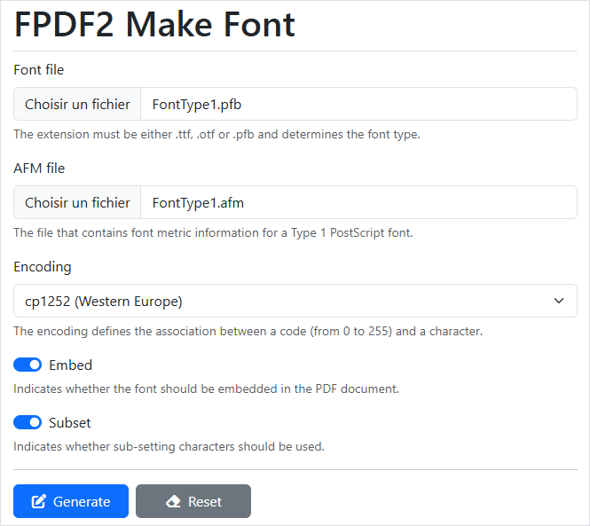

# FPDF2 Make Font

This repository is used within [FPDF2](https://github.com/laurentmuller/fpdf2)
to create fonts.

All code is copied from the [FPDF](https://www.fpdf.org/) created by Olivier
PLATHEY.

**Function:**

```php
makeFont(string fontFile [, string encoding [, boolean embed [, boolean subset]]])
```

**Parameters:**

- `fontFile`: The path to the `.ttf`, `.otf` or `.pfb` file.
- `encoding`: The name of the encoding to use. The default value is `cp1252`.
- `embed`: Whether to embed the font or not. The default value is `true`.
- `subset`: Whether to subset the font or not. The default value is `true`.

The first parameter is the name of the font file. The extension must be either
`.ttf`, `.otf` or `.pfb` and determines the font type. If your Type1 font is
in ASCII format (`.pfa`), you can convert it to binary (`.pfb`) with the help
of [Type 1 utilities](http://www.lcdf.org/~eddietwo/type/#t1utils). For Type1
fonts, the corresponding `.afm` file must be present in the same directory.

The encoding defines the association between a code (from 0 to 255) and a
character. The first 128 are always the same and correspond to ASCII; the
following are variable. Encodings are stored in `.map` files. The available
encoding ones are:

- cp1250 (Central Europe)
- cp1251 (Cyrillic)
- cp1252 (Western Europe)
- cp1253 (Greek)
- cp1254 (Turkish)
- cp1255 (Hebrew)
- cp1257 (Baltic)
- cp1258 (Vietnamese)
- cp874 (Thai)
- ISO-8859-1 (Western Europe)
- ISO-8859-2 (Central Europe)
- ISO-8859-4 (Baltic)
- ISO-8859-5 (Cyrillic)
- ISO-8859-7 (Greek)
- ISO-8859-9 (Turkish)
- ISO-8859-11 (Thai)
- ISO-8859-15 (Western Europe)
- ISO-8859-16 (Central Europe)
- KOI8-R (Russian)
- KOI8-U (Ukrainian)

Of course, the font must contain the characters corresponding to the selected
encoding.

The third parameter indicates whether the font should be embedded in the PDF or
not. When a font is not embedded, it is searched in the system. The advantage
is that the PDF file is smaller; but if it is not available, then a
substitution font is used. So you should ensure that the required font is
installed on the client systems. Embedding is the recommended option to
guarantee a correct rendering.

The last parameter indicates whether sub-setting should be used, that is to say,
whether only the characters from the selected encoding should be kept in the
embedded font. As a result, the size of the PDF file can be greatly reduced,
especially if the original font was big.

After you have called the function (create a new file for this and include
`make.php`), a `.php` file is created, with the same name as the font file. You
may rename it if you wish. If the case of embedding, the font file is compressed
and gives a second file with `.z` as extension except if the compression
function is not available (it requires Zlib). You may rename it too, but in
this case you have to change the variable `$file` in the `.php` file
accordingly.

**Example:**

```php
require('src/makeFont.php');

makeFont('C:\\Windows\\Fonts\\comic.ttf','cp1252');
```

Which gives the files `comic.php` and `comic.z`.

Then copy the generated files to the font directory. If the font file could
not be compressed, copy it directly instead of the `.z` version.

Another way to call `makeFont()` is through the command line:

```console
php src\makeFont.php C:\Windows\Fonts\comic.ttf cp1252
```

**Declaration of the font in the script:**

The second step is straightforward. You only need to call the `addFont()`
method:

```php
$pdf->addFont('Comic', PdfFontStyle::REGULAR, 'comic.php');
```

And the font is now available (in regular and underlined styles), usable like
the others. If we had worked with Comic Sans MS Bold (`comicbd.ttf`), we would
have written:

```php
$pdf->addFont('Comic', PdfFontStyle::BOLD, 'comicbd.php');
```

**Full Example:**

Now let's see a complete example. We will use the
[Ceviche One](https://fonts.google.com/specimen/Ceviche+One) font. The first
step is the generation of the font files:

```php
require('src/makeFont.php');

makeFont('CevicheOne-Regular.ttf', 'cp1252');
```

The script produces the following output:

- Font file compressed: `CevicheOne-Regular.z`.
- Font definition file generated: `CevicheOne-Regular.php`.

Alternatively, we could have used the command line:

```console
php src\makeFont.php CevicheOne-Regular.ttf cp1252
```

We can now copy the two generated files to the font directory and write
the script:

```php
use fpdf\Enums\PdfFontStyle;
use fpdf\PdfDocument;

$pdf = new PdfDocument();
$pdf->addFont('CevicheOne', PdfFontStyle::REGULAR, 'CevicheOne-Regular.php');
$pdf->addPage();
$pdf->setFont('CevicheOne', PdfFontStyle::REGULAR, 45);
$pdf->write(10, 'Enjoy new fonts with FPDF!');
$pdf->output();
```

**User interface:**

A small application has been created under the `ui` directory.



## Code Quality

[](https://insight.symfony.com/projects/7f51544f-dfa3-4123-aed2-9c9dc8b4277f)
[](https://app.codacy.com/gh/laurentmuller/fpdf2-make-font/dashboard?utm_source=gh&utm_medium=referral&utm_content=&utm_campaign=Badge_grade)
[](https://phpstan.org/blog/find-bugs-in-your-code-without-writing-tests)
[](https://psalm.dev/docs/running_psalm/installation/)
[](https://www.codefactor.io/repository/github/laurentmuller/fpdf2-make-font)
[](https://codecov.io/gh/laurentmuller/fpdf2-make-font)

## Actions

[](https://github.com/laurentmuller/fpdf2-make-font/actions/workflows/php-cs-fixer.yaml)
[](https://github.com/laurentmuller/fpdf2-make-font/actions/workflows/php_stan.yaml)
[](https://github.com/laurentmuller/fpdf2-make-font/actions/workflows/php_unit.yaml)
[](https://github.com/laurentmuller/fpdf2-make-font/actions/workflows/pslam.yaml)
[](https://github.com/laurentmuller/fpdf2-make-font/actions/workflows/rector.yaml)
[](https://github.com/laurentmuller/fpdf2-make-font/actions/workflows/lint.yaml)
[](https://github.styleci.io/repos/963306628?branch=master)
